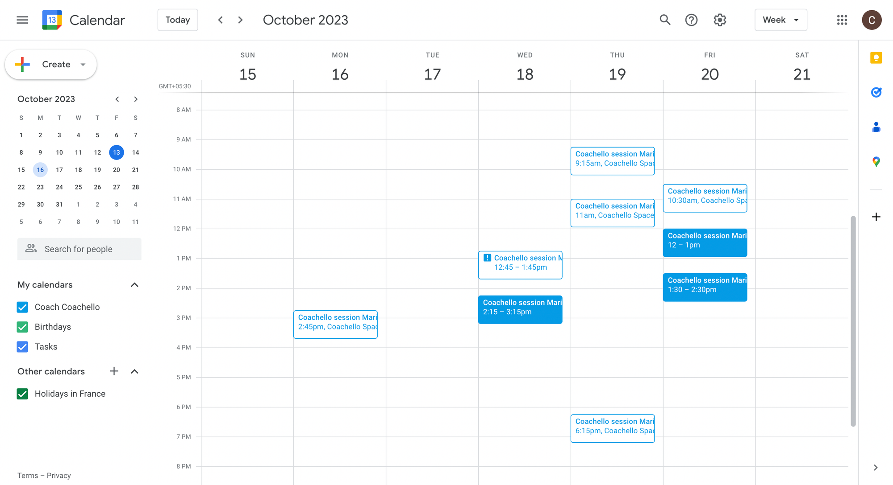

# Take-home-assignment-Python

## 1. Python Refactoring Exercise: Prompt Formatting

**Skills tested:**

Ability to understand problems as a whole, and structuring code adhering to object-oriented programming principles and object-oriented software design principles .

**Background:**

You've been presented with a simple script that formats and prints a prompt that makes the LLM act as an AI coach. The script provides details of a coach and a static sample coaching session transcript.

**Task:**

Your job is to refactor this script, leveraging object-oriented programming principles and object-oriented software design principles to make the code more modular and elegant (hint: result may produce multiple files). The primary objective is to allow for easy addition of new parameters in the future, ensuring the code remains scalable and maintainable.

**Instructions:**

1. Write a class named **`PromptHandler`**.
2. The class should have methods to set client details and other relevant parameters.
3. The class should be capable of dynamically handling various parameters like **`language`**, **`format`**, and so on. Based on the language and format, the `**transcript**` needs to be changed as well. 
4. As there will be different `**transcripts**` available, they won’t change often and still require constant edits, and new transcripts will come in as we progress.
5. The class should have a method named **`get_formatted_prompt`** which will return the final formatted string by replacing placeholders with their respective values.

Remember, the goal is to ensure modularity, so that in the future, if we want to introduce more details or change the structure, it should require minimal changes.

**Starter Code:**

```
prompt_template = """
You're an ICF MCC certified coach, responsible for training individuals to meet international coaching standards.

Following are your client details:
First Name: {first_name}
Last Name: {last_name}
Email: {email}
Preferred Language: {language}

Following is a sample script that explains how coaching should be carried out.
Format: short
Script:

  Coach: 'How do you feel about the situation?' 
  Client: 'I'm a bit overwhelmed.'
  ...< 100+ lines >...


Please follow the instructions carefully and ensure each session is fruitful.
"""

formatted_prompt = prompt_template.format(
    first_name="John",
    last_name="Doe",
    email="john.doe@example.com",
    language="English"
)

print(formatted_prompt)
```

## 2. Algorithms and Data structures.  Find free times in a Calendar.

**Background:**

Given a set of events from a calendar, the task is to find the available time slots for scheduling new events.

**Task:**

**Task:**

Given a set of events from a calendar, the task is to find the available time slots for scheduling new events.

**Input:**

The input will be provided in JSON format and will consist of the following fields:

- `calendar`: A list of events in the calendar, each event containing the following fields:
    - `start_time`: The start time of the event.
    - `end_time`: The end time of the event.

**Output:**

The output should be a list of available time slots for scheduling new events, each time slot containing the following fields:

- `start_time`: The start time of the free time slot.
- `end_time`: The end time of the free time slot.

<!-- insert event.json link -->
**Input data:** [event.json](./asset/events.json)

**Output format:**

The output should be provided in JSON format and will consist of a list of available time slots for scheduling new events. Each time slot will contain the following fields:

- `start_time`: The start time of the free time slot.
- `end_time`: The end time of the free time slot.

Here is an example of the expected output format:
```
[
  {
    "start_time": "2022-09-01T08:00:00",
    "end_time": "2022-09-01T10:00:00"
  },
  {
    "start_time": "2022-09-01T13:00:00",
    "end_time": "2022-09-01T14:30:00"
  },
  ...
]
```

**Output format:**

The output should be provided in JSON format and will consist of a list of available time slots for scheduling new events. Each time slot will contain the following fields:
```
{
  "2022-09-01": [
    {
      "start_time": "08:00:00",
      "end_time": "10:00:00"
    },
    {
      "start_time": "13:00:00",
      "end_time": "14:30:00"
    },
    ...
  ]
}
```
**Test case:**

Please note, it is possible this calendar may get updated while you try it.


